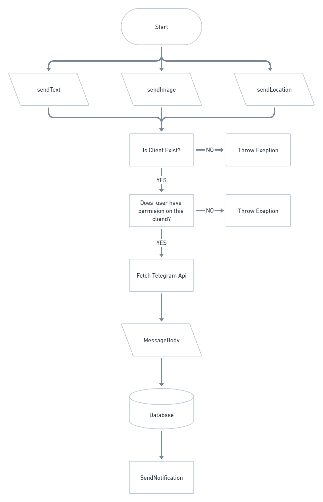
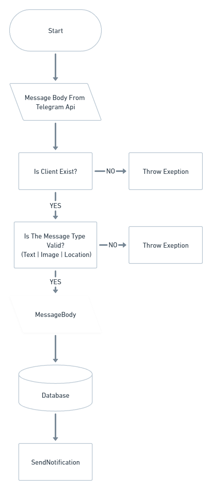

<p align="center">
  <a href="http://nestjs.com/" target="blank"></a>
</p>

# <center>TELEGRAM BOT NOTIFER SYSTEM</center>

## Tech Stack

- NestJS
  - Deployed on [<ins>heroku</ins>](https://telegram-notifer.herokuapp.com/).
- Prisma
- MongoDB
  - Deployed on Atlas.

## Postman Files

You can take a look at the postman documentation [<ins>here</ins>](https://documenter.getpostman.com/view/18029963/VV4s1zUP).

You can try postman by sending requests from the link below without even installing it on your computer, the **_Tests script_** is saves the bearer token to the environment if loggin was succesfull.
You can see **_Tests script_** image below.

<p align="center">
 
</p>

## Installation

```bash
# Install dependencies
$ npm install
```

## Running the app

Please fill in the sample environments in the env.example file and rename the file to .env before starting the application
Enter a link to BASE_URL environment that your localhost's telegram api can reach. You can use [<ins>Ngrok</ins>](https://ngrok.com/) for this.

```bash
# Watch mode
$ npm run start:dev
```

## <center>**MESSAGE FROM CLIENT(BOT) TO USER VİA ENDPOİNT**</center>

<p align="center">
 
</p>

## <center>**MESSAGE FROM USER TO CLIENT(BOT) VİA TELEGRAM APP**</center>

<p align="center">
 
</p>
